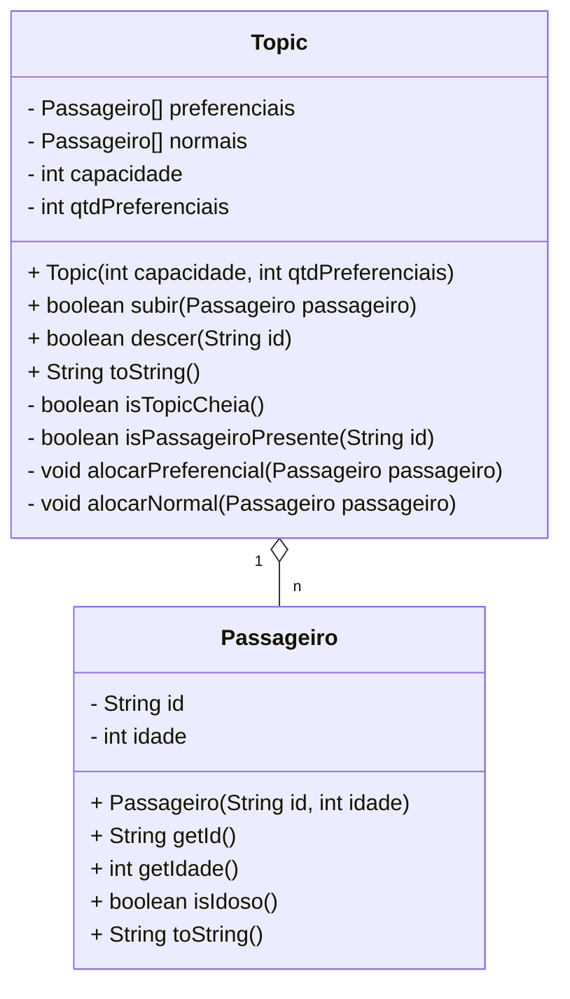

# Topic de Luxo (vetor de nulos, múltiplos vetores, métodos privados)


O objetivo dessa atividade é exercitar o que vocês aprenderam no cinema com algumas variações. Aqui, vamos implementar um sistema de alocação de passageiros em uma topic. Nossa topic tem uma quantidade máxima de passageiros, mas também define alguns assentos preferenciais.

- [Requisitos](#requisitos)
- [Diagrama](#diagrama)


***
## Requisitos
Seu sistema deverá:

- Inicializar e Mostrar
  - A topic deve ser inicializada com a quantidade máxima de assentos e a quantidade de cadeiras preferenciais.
  - Exiba os assentos preferenciais e normais na seguinte formatação:
    - Assentos preferenciais começam com @.
    - Assentos normais começam com =.
  - Se o assento está ocupado, mostre o nome e a idade do passageiro nele.
    - Exemplo: [@joao:70 @bia:72 =davi:23 =ana:25 =rex:39 ].

- Inserir Passageiro:
  - O passageiro possui nome e idade.
  - Regras de alocação:
     - Idosos (idade ≥ 65):
       - Devem ser alocados na primeira cadeira preferencial livre.
       - Caso não haja cadeiras preferenciais livres, são alocados em cadeiras normais.
    - Demais Passageiros:
       - Devem ser alocados na primeira cadeira normal livre.
       - Caso não haja cadeiras normais livres, são alocados em cadeiras preferenciais.
  - Remover Passageiro:
    - O passageiro deve ser removido com base no nome.
     - Caso o nome não exista, exiba uma mensagem informando que o passageiro não está na topic. 
- Mensagens de Feedback
  - Caso a topic esteja cheia, ao tentar inserir um passageiro, exiba: Topic lotada. 
  - Caso o passageiro já esteja na topic, exiba: Passageiro já está na topic. 
  - Caso tente remover um passageiro que não esteja na topic, exiba: Passageiro não está na topic.

Existe uma lista para as cadeiras normais e outra para as preferenciais. Para facilitar nas operações de busca e inserção, você deverá criar vários métodos privados para simplificar a lógica dos métodos principais.

## Diagrama



## Exemplo de execução
```java
public class Runner {

    public static void main(final String[] args) {

        Topic topic = new Topic(5, 2);
        System.out.println(topic.toString()); //[@ @ = = = ]

        Passageiro passageiro = new Passageiro("davi", 17);
        topic.subir(passageiro);
        System.out.println(topic); //[@ @ =davi:17 = = ]

        passageiro = new Passageiro("joao", 103);
        topic.subir(passageiro);
        System.out.println(topic); //[@joao:103 @ =davi:17 = = ]
        passageiro = new Passageiro("ana", 35);
        topic.subir(passageiro);
        System.out.println(topic); // [@joao:103 @ =davi:17 =ana:35 = ]

        passageiro = new Passageiro("rex", 20);
        topic.subir(passageiro);
        passageiro = new Passageiro("bia", 16);
        topic.subir(passageiro);
        System.out.println(topic); // [@joao:103 @bia:16 =davi:17 =ana:35 =rex:20 ]

        topic.descer("davi");
        System.out.println(topic);
        passageiro = new Passageiro("aragao", 96);
        topic.subir(passageiro);
        System.out.println(topic); // [@joao:103 @bia:16 =aragao:96 =ana:35 =rex:20 ]

        passageiro = new Passageiro("lucas", 23);
        if(!topic.subir(passageiro)){
            System.out.println("Topic lotada"); //Topic lotada
        }

        if(!topic.descer("marcelo")){
            System.out.println("Passageiro nao esta na topic"); //Passageiro nao esta na topic
        }

        topic.descer("ana");
        passageiro = new Passageiro("bia", 16);
        if(!topic.subir(passageiro)){
            System.out.println("Passageiro ja esta na topic"); //Passageiro ja esta na topic
        }
        System.out.println(topic); //[@joao:103 @bia:16 =aragao:96 = =rex:20 ]

    }
}

```


## Relatório de Entrega

Não esqueça de preencher o seguinte [formulário](https://forms.gle/xTkFeehZ2ocTctPu9) ao completar a atividade.
